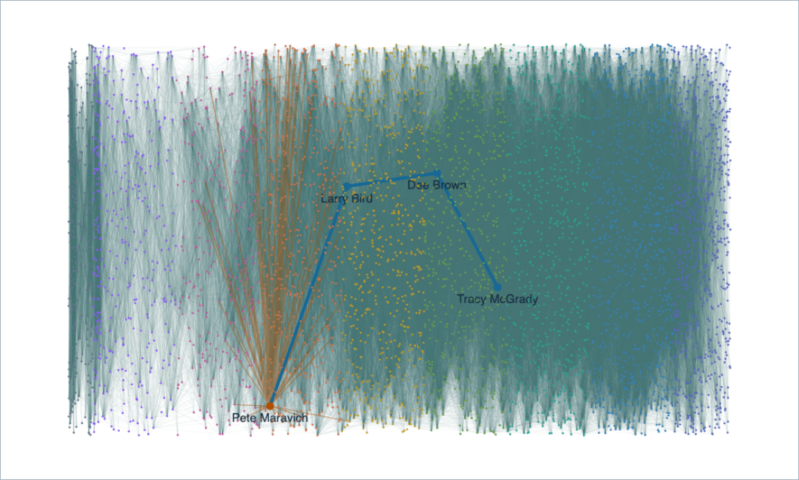

# Complete player-network visualizer

Date: 2026-10-10. Baseline: `364b901`. The user clarified that the field should contain **all players and all connections**, rather than only the selected shortest path.

## Result

`/graph?all=true` loads every player and every teammate relationship in the current pinned graph: **5,106 nodes and 101,395 undirected edges**, including all 41 isolates. No neighborhood limit or relationship cap applies. `/api/network` exposes the same complete graph payload. The API regression independently compares its entire pair set to `graph.edges()`, checks every player, and verifies `truncated: false`.

`/graph?from=maravpe01&to=mcgratr01&all=true` displays the complete field with the requested Maravich → Larry Bird → Dee Brown → McGrady chain highlighted in blue. Search for any player to focus them and highlight their actual connections in orange. The selected player's connection list opens relationship evidence. Fit-all, fit-chain, player-focus, pan and zoom change only the viewport; browser assertions verify that counts remain 5,106 / 101,395 after searching, zooming and selecting an isolated player.

Player positions are stable and arranged by debut season, with colors indicating eras. This is an explanatory layout rather than a claim of geographical, physical or community proximity. Every base connection is drawn as a low-opacity line in the initial overview; focus/path passes add emphasis. Labels appear at closer zoom levels, while highlighted player names remain visible. Sparse labels do not remove nodes or relationships.

The existing Rust/WASM Canvas renderer batches the background lines and indexes endpoints to avoid a player lookup for every edge. A spatial grid supports nearest-node picking, with a finite-node fallback at extreme zoom levels. No JavaScript graph library or force simulation is added. The full payload uses an `application/json` script with `<`, `>` and `&` escaped; dynamic player/connection labels use DOM text APIs.

The smaller selected-chain SVG remains on chain pages, with profile/evidence links and horizontal desktop or vertical phone layouts. A chain-page link retains its selected alternative and cursor when opening the full field. The main navigation also opens the complete network directly.

## Verification

Commands and actual outputs are retained alongside this report:

- `cargo test --workspace`: **112 passed, zero failed, 10 explicitly ignored** (seven browser/canvas journeys and three live-provider tests). [Log](rust-tests.log).
- `cargo test -p app-server --test browser_e2e --test canvas_browser -- --ignored --nocapture`: **seven passed, zero failed**. [Log](browser-tests.log).
- `cargo fmt --all --check` and host plus WASM Clippy with `-D warnings` passed. [Host log](clippy-host.log), [WASM log](clippy-wasm.log).
- The full-network browser journey checks all payload counts and exact highlighted path, player search, changing the viewport without truncation, relationship selection, and searching isolated Timmy Allen. It also verifies that changing player clears the previous relationship's evidence URL. The final empty-snapshot regression covers both `/api/network` and `/graph?all=true`.
- The selected-chain journey checks four nodes and three lines, actual game-count captions, keyboard Enter activation of a player profile, and desktop/390px phone evidence navigation. It establishes keyboard activation, not a full accessibility conformance audit.
- Existing bounded-neighborhood and canvas journeys passed; expansion, source panels, cursor/alternative selection, pointer and keyboard interactions retain their existing behavior.
- Release server rebuilt and restarted on port 3000; the user's in-app browser shows the full field.

Observed full-field readiness was roughly 1–3 seconds in local Chromium runs, including 1,221 ms for a targeted run and higher times under concurrent checks. These are local observations, not portable performance guarantees. The page payload is approximately 13 MB. The view includes every accepted edge in the pinned evidence graph; source coverage remains incomplete historically.

## Research and review

[Research note](../chain-visualizer-research.md) contains the primary-source examples discovered with Firecrawl, gh_grep and awesome-list references, along with Jev screening and source-claim verification. Sigma's large-network example and MDN Canvas guidance informed low-opacity background edges, focus overlays, label thresholds and batching.

An initial Jev gate on the smaller chain-only patch contradicted actual passed-test receipts with confidence 0.56 / 0.52, and reported safe-to-apply 0.38 / composite 0.751. A stronger reviewer inspected the raw logs and original patch, found those test verdicts inconsistent with the supplied execution evidence, and recorded the limits of the UI checks. The expanded network received a separate [final gate](jev-gate.json), which escalated with composite 0.6539 and safe-to-apply 0.43. It incorrectly contradicted the test totals with confidence 0.20 (verified 0.29 / contradicted 0.47 / unsupported 0.24). A stronger reviewer resolved the escalation by inspecting the full pair-set regression, browser assertions and all 30 workspace result groups, and independently rerunning both Clippy commands successfully. All five completion claims were supported; no remaining concrete blocker was found in the reviewed scope. This is a resolved escalation, not automatic Jev approval. Stronger review of the expanded change found two actual defects—stale evidence URLs after player changes and empty-snapshot panics—which were fixed and covered by regressions.

The browser harness now separates inspector response-body capture failures from application console/JavaScript errors. An assertion about uncaptured response contents still fails closed. This avoids misreporting Chromium's eviction of the large page from its inspector cache as an application error.

## Actual rendered field

[Selected-chain desktop screenshot](maravich-mcgrady-visualizer.png) · [Phone screenshot](maravich-mcgrady-mobile.png)
