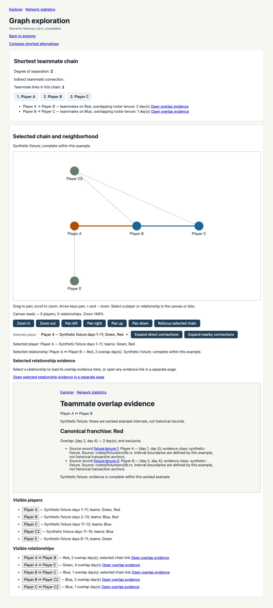
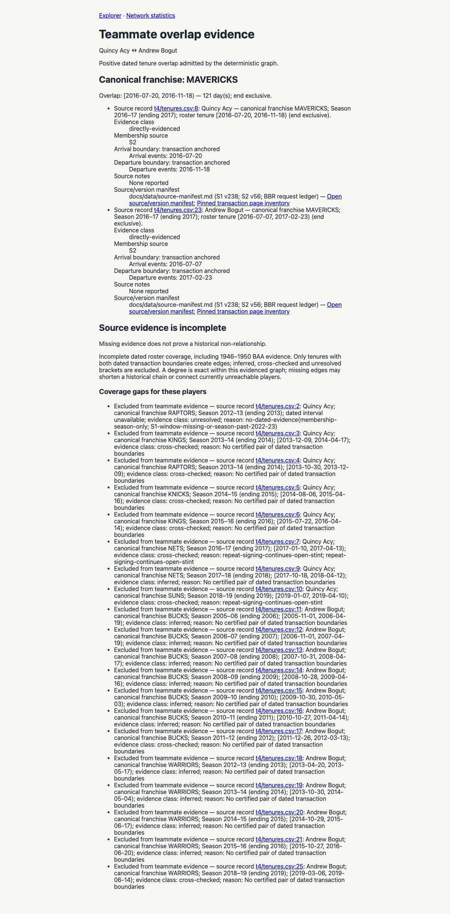
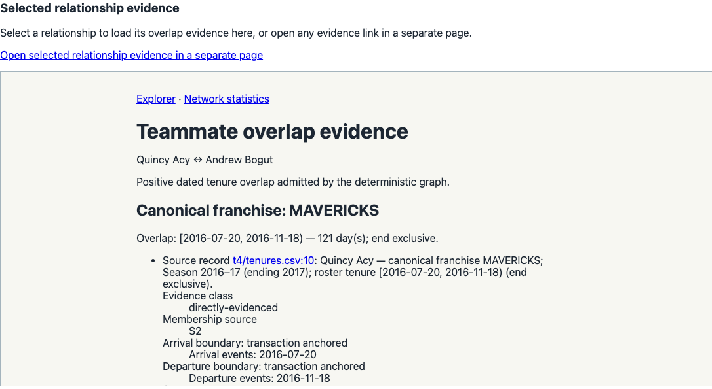

# Final application verification — T17 / issue #18

The complete Rust application was started through `./scripts/run-app.sh` against the full committed report snapshot, with release WASM built first, no database service and semantic credentials removed from the launching environment. Actual HTTP responses and browser journeys confirm the implemented behavior. This is local evidence; no remote CI result or complete historical graph is claimed.

[Ordered commands, results and hashes](commands-and-hashes.json) link the actual [raw check output](logs/). Machine-specific path prefixes were removed and redundant trailing empty lines normalized in published logs; hashes of the unchanged external originals are retained. Checks were repeated after the final review corrections; the command manifest identifies the source commit and exact rebuilt report hashes. Final review base is origin/main `f8e743ca30939476433c680e7a29169d70c3fa41`. Generated audit utilities were also executed against retained artifacts after the application test pipeline. Raw archives and source cache pages were unchanged; the isolated T4 reconciliation checkpoint was regenerated from those pinned inputs.

## Actual checks

| Check | Actual result / receipt |
|---|---|
| Release canvas build before workspace suite | Passed; [01](logs/01-wasm-build.log) |
| Rust workspace | **104 passed, 7 intentionally ignored**, zero failures; [02](logs/02-rust-workspace.log) |
| Source-preparation Python suite | **92 passed**; [03](logs/03-python-source.log) |
| Rust formatting | Passed; [04](logs/04-format.log) |
| Host and wasm32 Clippy, warnings denied | Passed; [05](logs/05-clippy-host.log), [06](logs/06-clippy-wasm.log) |
| Explicit browser E2E + canvas browser | **3 + 1 passed**, Chromium 153.0.8010.12; [07](logs/07-browser.log) |
| Explicit routine provider log capture | **1 passed** with `RUSTFLAGS='--cfg test_capture'`; [08](logs/08-credential-logs.log). The ordinary target contains zero tests. |
| Labeled semantic validation | **44 valid cases**, disjoint IDs/splits; [09](logs/09-semantic-labels.log) |
| Frozen runtime replay | **132 outcomes**, no provider calls; [10](logs/10-semantic-replay.log) |
| Semantic artifact consistency | 44 labels, 132 outcomes, 18 summaries, policy/order/source hash/usage/degree invariants audited; [11](logs/11-semantic-audit.log) |
| Current-vs-original audit join and audit integrity | 6,246 original cases, 1,548 groups, six 50-case strata, 21,984 source locators and 123,278 associations; [12](logs/12-corrected-audit.log), [13](logs/13-historical-audit.log) |
| Actual raw snapshot SHA verification | All three bulk archives and **80 cached pages**, zero downloads; [14](logs/14-source-snapshot.log) |
| Default full-app wrapper startup | Port 49333; [15](logs/15-app-startup.log) |
| Fresh full-snapshot APIs and WASM response | Counts, evidence, no-key fallback and asset magic checked; [16](logs/16-runtime-apis.log), [API receipts](runtime-apis.json) |

The seven workspace ignores are explicit browser/canvas/live-provider checks. Browser targets are separately exercised above; live-only checks are not rerun in T17. Recorded paid semantic experiments remain in [evaluation evidence](../../evaluation/README.md). The tested API/browser seams are the user-approved black-box seams, with source-preparation unit tests retained for deterministic parsing arithmetic.

To repeat the runtime receipt capture, start the wrapper with a fresh server before the first statistics request, then run:

```sh
env -u OPENROUTER_API_KEY -u TYPESAFE_API_KEY NBA_PORT=49333 ./scripts/run-app.sh
# In a second terminal:
python3 scripts/capture-runtime-evidence.py --url http://127.0.0.1:49333 --output target/runtime-apis.json
```

No key is required for these requests. `scripts/publish-final-evidence.py --raw-root <raw-log-root>` publishes the actual logs with path prefixes sanitized. It never fabricates test output. The command/result manifest explicitly separates startup from completed checks. Committed runtime graph metadata summarizes the full response count; the full raw graph response is retained outside the repo with its capture hash. The published Acy evidence response contains only the actual Acy/Bogut edge for compactness.

## Full evidenced graph

Fresh `/api/graph`, `/api/stats` and `/api/coverage` agreed: **5,106 nodes, 2,227 certified tenures, 1,501 undirected edges, 4,176 connected components, finite diameter 20, 55,842 reachable unordered pairs and 12,977,223 unreachable unordered pairs**. These sum to `5106 × 5105 / 2 = 13,033,065` distinct unordered pairs. Self-pairs are excluded; isolates each count as a component. Unreachable pairs are omitted from the histogram and finite diameter, not assigned a finite distance. Computation is deterministic BFS in Rust.

| Degree | Reachable pairs | Degree | Reachable pairs |
|---:|---:|---:|---:|
| 1 | 1,501 | 11 | 3,912 |
| 2 | 1,921 | 12 | 2,995 |
| 3 | 2,641 | 13 | 2,386 |
| 4 | 3,711 | 14 | 1,474 |
| 5 | 4,856 | 15 | 933 |
| 6 | 5,921 | 16 | 496 |
| 7 | 6,338 | 17 | 339 |
| 8 | 6,119 | 18 | 195 |
| 9 | 5,404 | 19 | 88 |
| 10 | 4,572 | 20 | 40 |

Measured cold statistics HTTP wall time was **1.210278 s**, followed by **0.001317 s** cached. These single samples came from a localhost debug server on Darwin/arm64, not a general performance guarantee. OS/Python versions and exact timings are in the API receipts.

Only positive intervals with both dated transaction anchors, stable identity and no blocking unresolved flags enter the graph. Excluded tenure counts are 10,170 cross-checked, 13,445 inferred and 4,215 unresolved. **3,537 players have no certified tenure**, coverage is `complete: false`, and unresolved 1946–1950 BAA evidence remains explicit. The real Acy/Bogut edge is Dallas/MAVERICKS for 121 days; current full snapshot source references are `t4/tenures.csv:123` and `:2602`. Postseason-only Luca Vildoza (`nba:1630492`) is included as an evidenced person; his inferred 2022 stint (`:19618`) does not create edges. Five nameless S1 play-by-play references (471, 775, 1277, 1787, 2794) remain unresolved identity candidates. Other source disagreements are retained in the T3 register; the build does not claim every historical identity is fully reconciled.

The [historical audit](../historical-audit/README.md) preserves actual reading outcomes and fallible model signals separately. Current membership-key joins do not count as new source reading. Its original selected rows are Git-recoverable at commit `474481bde27ac33887ae9f285e351735f0905571`; current source hash is `bfe9f5f2b60615af1160a157f7c482ee7ea3b9c86390e28f87a46c863ae39c04`. Pre-correction discrepancies are not represented as current graph defects.

## Semantic evidence and limits

No live provider experiment was repeated in T17. The retained evaluation has 44 hand-labeled cases (21 calibration, 23 held-out), 132 frozen variants and 102 final calls. Held-out baseline labels matched **11/11 resolution, 4/8 routing and 0/4 ranking**; ranking abstained three times and gave one incorrect hostile preference ordering. This is a semantic error, not a graph arithmetic error. Wording/order sensitivity, each failed/uncertain outcome, frozen calibration objective/grid/tie-break and all per-call metadata remain published. Costs/tokens are reported provider receipts; initial aborted-run spend is unknown. Original 42 labels and two later pre-inference supplements, pilot captures and outcome-inspection chronology are explicitly retained. No broad accuracy claim follows from this small set.

## Actual browser artifacts

These screenshots were recaptured and visually inspected after the final review fixes, alongside the complete fresh browser suite. The real journey uses seven selected canonical players and all 79 corresponding committed tenure rows. It is a **real slice**, not the full snapshot or a mixture with synthetic rows. Slice-local Acy record `:10` maps to full record `:123`, and Bogut `:26` maps to `:2602`; every mapping and hash is retained in the [real-slice map](../t16/real-slice-map.json). The separate synthetic fixture and diamond test alternatives/filters deterministically.







## Acceptance evidence

[The 38-criterion matrix](acceptance-matrix.md) links each requirement to observable evidence and states its limitations. It does not turn unresolved source coverage or low ranking accuracy into a success claim. Final Jev gate scope/result and stronger independent review are separate review artifacts; this report alone does not assert PR readiness, remote green checks, integration merge or issue closure.

## Prior completion gate before source correction

The valid [Jev gate result](final-gate-result.json) is **`escalate`**, retained without retry: composite **0.7617**, minimum `safe_to_apply` **0.34**, with low-confidence/test-gap/blast-radius review signals. It checked the actual base `f8e743ca30939476433c680e7a29169d70c3fa41` through reviewed HEAD `5683a2f99c5d292554815d64ea42f285c7ad57c1`. [Scope](final-gate-scope.json) lists the **five complete raw file diffs** (39,905 characters) and 16,249 characters of actual bounded evidence. The [input](final-gate-input.json) includes the correctly named changed `crates/app-server/tests/log_capture.rs`; other test/code/data paths are explicitly excluded from this scoped patch judgment and require independent full-diff review. A first larger input returned operational `400 max_tokens_exceeded`, which had no verdict; only its input was bounded before the valid call.

Six of seven claims were verified. The model labeled the aggregate workspace/Python-count claim “contradicted” at **confidence 0.07**, with probabilities verified 0.27 / contradicted 0.38 / unsupported 0.35. [Exact arithmetic recount](previous-workspace-result-recount.json) of the prior actual Rust result lines gives **102 passed, 0 failed, 7 ignored**; the Python log explicitly reports 90 tests and `OK`. This conflicting weak signal remains unresolved by the gate and is referred to stronger independent review; it is not silently changed to “auto.” Startup was verified at confidence 0.69, also requiring review. The gate used 21,763 input and 741 output tokens; no provider cost metadata was supplied.

This evidence-only addition records the already completed gate and arithmetic recount after its reviewed HEAD; it does not alter application behavior, source data or helper logic. It was not itself part of that gate's diff. The final independent review must cover the complete final state, including these receipt files. No PR readiness, issue closure or full-diff approval follows from this scoped escalation.


## Gate for the final review corrections

The new source revision `59780ce8cbe2b65e45a966879408866403c2d17d` received one [valid gate](review-corrections-gate-result.json), retained without retry. It escalated: composite **0.7576**, minimum `safe_to_apply` **0.30**. [Input](review-corrections-gate-input.json) retains ten complete actual raw source/test diffs (32,469 characters) and 12,785 characters of bounded evidence; generated source/audit CSV changes and browser test diff require independent full-diff review.

Two claims were verified, three unsupported, and the aggregated check-count claim was labeled contradicted at confidence **0.13** (verified 0.29 / contradicted 0.42 / unsupported 0.29). Exact [then-current recount](before-isolation/workspace-result-recount.json) gives **103 passed, zero failed, seven ignored**; [then-current Python stdout](before-isolation/logs/03-python-source.log) gives **92 tests and OK**, and [then-current browser stdout](before-isolation/logs/07-browser.log) gives **3 + 1 passed**. The gate's uncertainty remains an escalation for independent stronger review of the actual code and receipts; it is not claimed as automatic acceptance. It reported 22,865 input and 1,156 output tokens, with no provider cost metadata. Original prior gate/results and previous manifest/runtime/recount remain retained.

[Correction details](final-review-corrections.md) describe the source witness, runtime defense, validated query continuation, shared mappings and historical experiment qualification. Receipt publication after the reviewed source commit changes no app behavior; final independent review must also cover these documents and receipts.


## In-memory historical replay isolation

A follow-up Standards review identified that the initial adapter wrote cleaned historical CSVs which normal report-directory startup could import. The source revision `dbc4c78533c97052bc62b72a6cf5c09961a12c6c` removes that export: production file import and memory import share the same strict reader, while historical transformation stays in an offline binary's private memory buffers. Existing legacy directories were quarantined outside project checkouts; no raw sources changed.

The new public reader regression independently checks file and memory import both exclude the legacy uncertain row and keep the supported other pair. The actual offline replay reproduced all 132 frozen outcomes; [target CSV inventory](isolation-artifact-check.json) was unchanged before/after and the old generated report path stayed absent. [Measured/source artifact hashes](isolation-unchanged-artifacts.json) show the T4 source, labels, measured outcomes, policy, manifest and summary unchanged. The [prior 103-test receipt set](before-isolation/commands-and-hashes.json) remains preserved with its own logs/runtime/recount; current final logs contain **104 Rust tests**, **92 Python**, the same four actual browser checks, and the full replay/audit/startup checks.


The [isolation gate](isolation-gate-result.json) was called exactly once on the actual `dbc4c78` patch against `3783bb1`; [input](isolation-gate-input.json) contains three complete source/test diffs and real check/no-export/hash evidence. The implementer's Jev tool became unavailable before any request; the parent used the same prepared payload through its available tool, producing the sole valid verdict. It **escalated**, composite **0.8384167**, minimum `safe_to_apply` **0.55**, with low-confidence test-gap signals. All **four claims were verified** (confidences 0.95, 0.97, 0.91 and 0.67), none contradicted or unsupported. The aggregate check claim still needs review at 0.67. Usage was 13,398 input and 436 output tokens; no provider cost metadata supplied. This result is retained without retry. Stronger independent review of the merged actual patch and final documents remains pending; the gate is not automatic acceptance.
