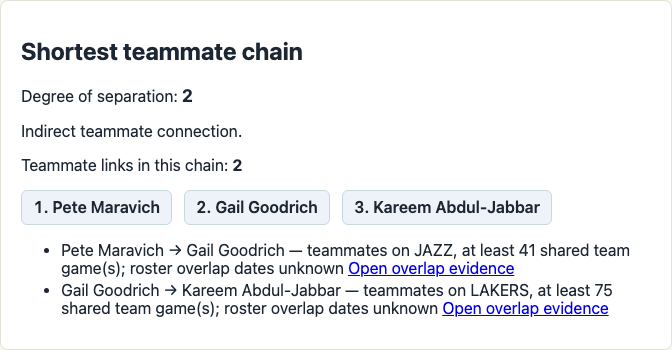
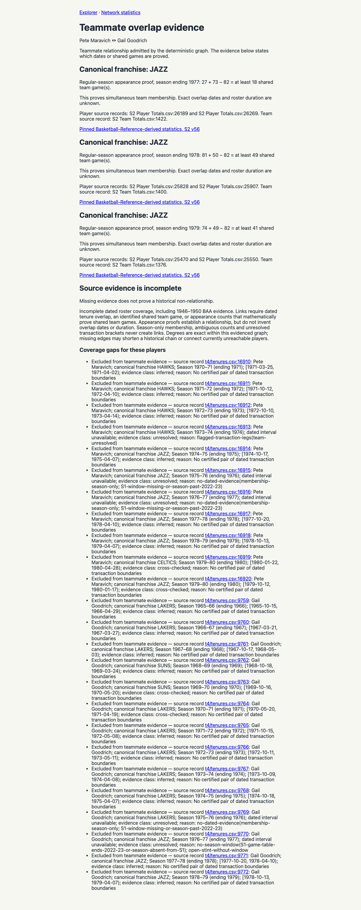

# Historical teammate-link repair — 2026-10-10

The reported `/chain?from=maravpe01&to=abdulka01` now returns degree 2, with 12 equal shortest alternatives. The selected browser receipt shows Pete Maravich → Gail Goodrich → Kareem Abdul-Jabbar. The app and evidence panel explicitly distinguish a proved teammate relationship from an unknown full roster-overlap duration.

## Diagnosis and regression loop

The original HTTP reproduction returned `unreachable`. A minimal three-player report reproduced the same failure in `appearance_counts_prove_historical_chain_without_inventing_tenure_dates`: the connected assertion failed before the relationship proof was added. The parser regression `test_final_transaction_without_li_end_tag_is_retained` returned zero transaction rows before its fix. Both now pass.

Four ranked hypotheses were tested: missing final transaction paragraphs; requiring both dated transaction boundaries even when another source proved a relationship; insufficient source coverage; and a shortest-path traversal bug. The first two were confirmed. The traversal was functioning against an incomplete graph. Some source gaps remain.

1. Cached Basketball Reference pages omitted optional closing `</li>` tags. The parser discarded final transaction paragraphs. Closing an item on the next item, outer list close, or end of input recovered 144 paragraphs across the existing 80 cached pages, including Kareem's June 16, 1975 trade. No pages were downloaded for this repair.
2. The graph admitted only fully dated, certified roster intervals. That correctly protected exact durations but unnecessarily discarded separately provable teammate relationships. It now also accepts pinned regular-season appearance proofs: for the same team-season with N games, A + B > N proves at least A + B − N shared team games. Equality or less creates no edge. Ambiguous totals, all-team summary rows, conflicting counts and season membership alone are rejected.
3. For low-appearance players without such a count proof, the exporter recovers an identified shared team game from pinned NBA play-by-play player actions. It requires canonical identity, matching franchise, season, game and date. Coach events and ambiguous identities are excluded. The independent checker resolves every exported certificate back to its original event rows.

The fixes preserve uncertain full tenure boundaries. `overlap_days` is numeric for dated overlap and nullable for appearance/game proofs; `minimum_shared_games` describes the latter. Chain pages, JSON APIs, query filters, rankings and the WASM canvas use the same evidence. The API change requires consumers to handle `overlap_days: null`.

## Whole-graph audit

| Measure | Baseline `5da5964` | Repaired |
| --- | ---: | ---: |
| Players | 5,106 | 5,106 |
| Teammate edges | 1,501 | 101,395 |
| Isolated players | 3,969 | 41 |
| Players lacking certified dated tenures | 3,537 | 3,516 |
| Maravich → Abdul-Jabbar | Unreachable | Degree 2 |

The isolated-player count differs from the count lacking certified tenures: a tenure can exist without an overlapping teammate. [baseline.json](baseline.json) records the two baseline values separately.

[audit.json](audit.json) independently compares the complete admitted pair set against the union of certified dated intervals, appearance proofs and dated game certificates. It checks 28,812 appearance rows against original source CSV lines, 99,710 appearance-proven pairs, 1,544 interval-proven pairs and 437 dated game witnesses. These sets overlap; the deduplicated total is 101,395 edges. Missing proved edges: **0**. Unsupported edges relative to these three evidence classes: **0**.

The audit also checks 12 known direct teammate pairs spanning Mikan–Pollard through Jokic–Murray, and excludes Billups–Iverson and Bellamy–DeBusschere as direct teammates despite season-level franchise membership. The game-witness checker independently validates 437 certificates across 62 source games, recovering 33 otherwise isolated players.

**Coverage is still incomplete.** The 41 remaining isolated players are enumerated in the audit. Some have very few appearances or fall outside the dated game coverage; some newest records lack regular-season evidence. We did not fabricate their relationships. This audit establishes completeness for the available accepted proofs, not for all historical NBA relationships. The repaired graph has 42 components, finite diameter 11 and 208,485 unreachable unordered player pairs.

## Verification and reproduction

```sh
python3 scripts/t4_fetch_bbr.py --no-fetch
python3 scripts/t4_reconcile.py
python3 scripts/t4_report.py
python3 scripts/export-appearance-counts.py
python3 scripts/export-game-witnesses.py
python3 scripts/check-game-witnesses.py
cargo run --release -p app-server --bin link-audit
cargo test --workspace
python3 -m unittest discover -s scripts -p 'test_*.py'
cargo test -p app-server --test browser_e2e --test canvas_browser -- --ignored --nocapture
cargo fmt --all --check
cargo clippy --workspace --all-targets -- -D warnings
cargo clippy -p canvas-view --target wasm32-unknown-unknown -- -D warnings
python3 scripts/check-historical-audit.py
python3 scripts/check-semantic-evaluation.py
```

The exporters and independent audits require the locally pinned source snapshots; browsing the shipped app requires only the committed reports. Source hashes and row counts are recorded in `t4/appearance-count-summary.json` and `t4/game-witness-summary.json`. The regenerated tenure CSV SHA-256 is `2bd2106ba3c0819b1a065246950f527a4267feb5f8a2054a11318205c04a1ab1`.

Observed results: 111 ordinary Rust tests passed (eight explicitly ignored), 94 Python tests passed, and all five explicit Chromium browser/canvas tests passed. Formatting and both host/WASM Clippy passed. The preserved historical audit and frozen semantic-evaluation integrity checks passed; no new paid semantic evaluation was run. Team/season filter regressions retain only matching appearance and game certificates. Negative regressions cover insufficient counts, conflicting totals, duplicate conflicting counts, and unknown/self game witnesses.

The jgrep self-review's count-group match was inspected: the edge requires the positive A + B − N proof, not mere membership. Its unknown-duration-as-zero search returned no matches. Temporary investigation artifacts were moved under ignored `target/link-repair-debug/`.

[rust-tests.log](rust-tests.log), [python-tests.log](python-tests.log), [browser-tests.log](browser-tests.log) and [runtime-connection.json](runtime-connection.json) retain actual execution receipts. Older reports remain historical snapshots; their old statistics are superseded by this repair audit.

## Rendered result

The selected full-report browser scenario and evidence panel pass with no JavaScript errors.




